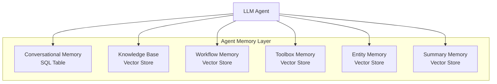
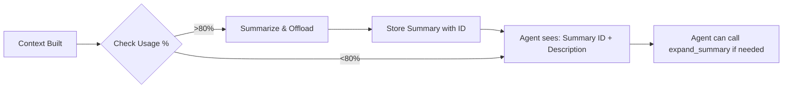
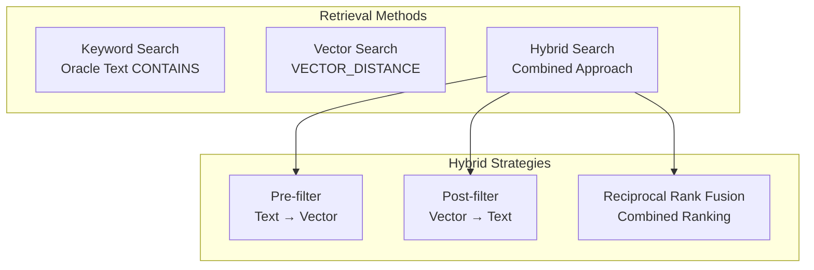
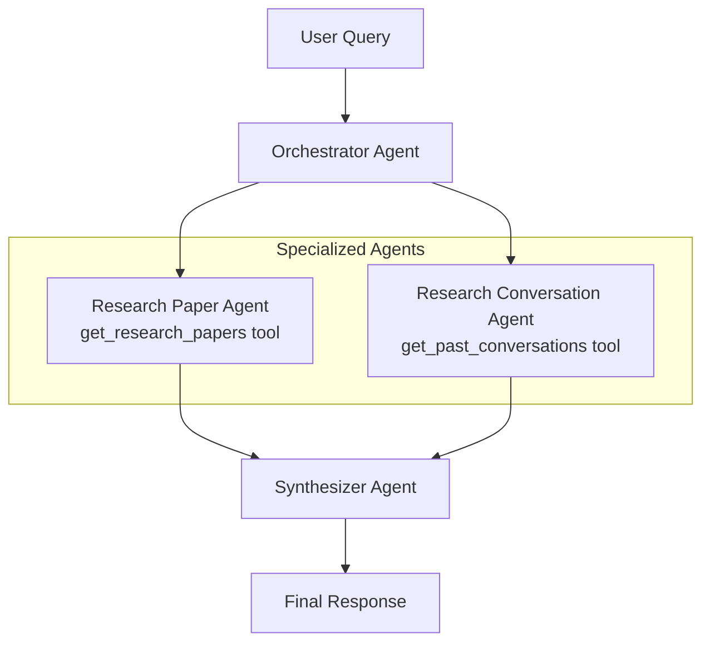

# Agentic AI Development Best Practices
## From Oracle AI Developer Hub

---

## TL;DR

Oracle's AI Developer Hub provides comprehensive patterns for building production-grade AI agents with **6 types of persistent memory**, **RAG pipelines**, and **multi-agent orchestration**. Key takeaways:
- **Memory Engineering** is the scaffolding for moving information optimally into AI systems
- **Context Engineering** is about managing what's in the context window at inference time
- **Semantic Tool Retrieval** solves the scalability problem with hundreds of tools
- **Agent orchestration** uses specialized agents as tools for complex workflows

---

## Table of Contents

1. [Memory Engineering for AI Agents](#1-memory-engineering-for-ai-agents)
2. [The 6 Types of Agent Memory](#2-the-6-types-of-agent-memory)
3. [Context Engineering Techniques](#3-context-engineering-techniques)
4. [RAG Pipeline Architecture](#4-rag-pipeline-architecture)
5. [Building AI Agents](#5-building-ai-agents)
6. [Agent Orchestration Patterns](#6-agent-orchestration-patterns)
7. [Session Memory Implementation](#7-session-memory-implementation)
8. [Incremental Tutorial](#8-incremental-tutorial)

---

## 1. Memory Engineering for AI Agents

### What is Agent Memory?

**Agent Memory** is the exocortex that augments an LLM—capturing, encoding, storing, linking, and retrieving information beyond the model's parametric and contextual limits. It provides the persistence and structure required for long-horizon reasoning and reliable behaviour.

### What is Memory Engineering?

**Memory Engineering** is the scaffolding and control harness that we design to move information optimally and efficiently into, through, and across all components of an AI system (databases, LLMs, applications etc). It ensures that data is captured, transformed, organized, and retrieved in the right way at the right time.

### Why Memory Engineering Matters

Without memory, agents:
- ❌ Forget previous conversations
- ❌ Can't learn from past interactions
- ❌ Repeat the same mistakes
- ❌ Lack context for complex tasks

With proper memory engineering, agents can:
- ✅ Maintain context across sessions
- ✅ Learn and improve over time
- ✅ Access relevant knowledge when needed
- ✅ Execute complex multi-step workflows

---

## 2. The 6 Types of Agent Memory



| Memory Type | Human Analogy | Purpose | Storage | Operations |
|-------------|---------------|---------|---------|------------|
| **Conversational** | Short-term memory | Chat history per thread | SQL Table | Thread-based retrieval |
| **Knowledge Base** | Long-term semantic memory | Facts, documents, search results | Vector Store | Semantic search |
| **Workflow** | Procedural memory | Learned action patterns | Vector Store | Pattern matching |
| **Toolbox** | Skill memory | Available tools & capabilities | Vector Store | Semantic tool discovery |
| **Entity** | Episodic memory | People, places, systems mentioned | Vector Store | Entity extraction & search |
| **Summary** | Compressed memory | Condensed context for long conversations | Vector Store | Just-in-time expansion |

### Memory Layer Implementation

```python
class MemoryLayer:
    """
    A memory layer for AI agents using Oracle AI Database.
    
    Manages 6 types of memory:
    - Conversational: Chat history per thread (SQL table)
    - Knowledge Base: Searchable documents (Vector store)
    - Workflow: Execution patterns (Vector store)
    - Toolbox: Available tools (Vector store)
    - Entity: People, places, systems (Vector store)
    - Summary: Compressed context (Vector store)
    """
    
    def __init__(self, conn, conversation_table, knowledge_base_vs, 
                 workflow_vs, toolbox_vs, entity_vs, summary_vs):
        self.conn = conn
        self.conversation_table = conversation_table
        self.knowledge_base_vs = knowledge_base_vs
        self.workflow_vs = workflow_vs
        self.toolbox_vs = toolbox_vs
        self.entity_vs = entity_vs
        self.summary_vs = summary_vs
```

### Programmatic vs Agentic Operations

A key design decision is determining which operations should be **programmatic** (executed automatically) versus **agentic** (decided by the LLM):

| Operation | Programmatic | Agentic | Reason |
|-----------|:------------:|:-------:|--------|
| `read_conversational_memory()` | ✅ | ❌ | Context is essential for every response |
| `read_knowledge_base()` | ✅ | ❌ | Agent can't know what it doesn't know |
| `write_conversational_memory()` | ✅ | ❌ | Every interaction must be recorded |
| `write_workflow()` | ✅ | ❌ | Reliability - don't forget important patterns |
| `search_tavily()` | ❌ | ✅ | Only search when genuinely needed |
| `expand_summary()` | ❌ | ✅ | Judgment required for which summary to expand |

---

## 3. Context Engineering Techniques

> **Context engineering** refers to the set of strategies for curating and maintaining the optimal set of tokens during LLM inference.
> — *Anthropic*

### Context Management Flow



### Key Functions

#### 1. Calculate Context Usage
```python
def calculate_context_usage(context: str, model: str = "gpt-4o-mini") -> dict:
    """Calculate context window usage as percentage."""
    estimated_tokens = len(context) // 4  # ~4 chars per token
    max_tokens = MODEL_TOKEN_LIMITS.get(model, 128000)
    percentage = (estimated_tokens / max_tokens) * 100
    return {"tokens": estimated_tokens, "max": max_tokens, "percent": round(percentage, 1)}
```

#### 2. Summarize Context
```python
def summarise_context_window(content: str, memory_layer, llm_client) -> dict:
    """Summarise content using LLM and store in summary memory."""
    response = llm_client.chat.completions.create(
        model=model,
        messages=[{"role": "user", "content": f"Summarise this in 2-3 sentences:\n{content[:3000]}"}],
        max_tokens=200
    )
    summary = response.choices[0].message.content
    # Store in memory with unique ID
    summary_id = str(uuid.uuid4())[:8]
    memory_layer.write_summary(summary_id, content, summary, description)
    return {"id": summary_id, "description": description, "summary": summary}
```

#### 3. Just-in-Time Retrieval
The agent sees compact summaries and can expand them on demand:
```python
@toolbox.register_tool(augment=True)
def expand_summary(summary_id: str) -> str:
    """Expand a summary reference to full content."""
    return memory_layer.read_summary_memory(summary_id)
```

---

## 4. RAG Pipeline Architecture

### Retrieval Mechanisms



### 1. Text-Based Retrieval
```sql
SELECT arxiv_id, title, SUBSTR(text, 1, 200) AS text_snippet,
       SCORE(1) AS relevance_score
FROM research_papers
WHERE CONTAINS(text, :keyword, 1) > 0
ORDER BY SCORE(1) DESC
FETCH FIRST 10 ROWS ONLY
```

### 2. Vector-Based Retrieval
```sql
SELECT arxiv_id, title, abstract,
       ROUND(1 - VECTOR_DISTANCE(embedding, :q, COSINE), 4) AS similarity_score
FROM research_papers
ORDER BY similarity_score DESC
FETCH APPROX FIRST {top_k} ROWS ONLY WITH TARGET ACCURACY 90
```

### 3. Hybrid Retrieval with RRF
Reciprocal Rank Fusion combines rankings from multiple retrieval methods:
```
RRF_Score = 1/(k + rank_vector) + 1/(k + rank_text)
```

| Approach | Strength | Best For |
|----------|----------|----------|
| **Pre-filter** (CONTAINS first) | Fast, keyword-strict | Narrow keyword search |
| **Post-filter** (Vector first) | Semantically rich | Exploratory queries |
| **RRF** | Best of both worlds | Production systems |

---

## 5. Building AI Agents

### Agent with Tools (OpenAI Agents SDK)

```python
from agents import Agent, Runner
from agents.tool import function_tool

@function_tool
def get_research_papers(user_query: str, retrieval_mode: str = "hybrid", top_k: int = 5) -> str:
    """
    Retrieves academic research papers relevant to the user's query.
    """
    if retrieval_mode == "keyword":
        rows, columns = keyword_search_research_papers(conn, user_query)
    elif retrieval_mode == "vector":
        rows, columns = vector_search_research_papers(conn, embedding_model, user_query, top_k)
    else:  # hybrid
        rows, columns, _ = hybrid_search_research_papers_pre_filter(
            conn=conn, embedding_model=embedding_model,
            search_phrase=user_query, top_k=top_k
        )
    return format_results(rows, columns)

# Create agent with tools
research_paper_assistant = Agent(
    name="Research Paper Assistant",
    model="gpt-4",
    instructions="You are a Research Paper Assistant...",
    tools=[get_research_papers]
)

# Run agent
result = await Runner.run(
    starting_agent=research_paper_assistant,
    input="Get me papers on mission planning"
)
```

### Semantic Tool Retrieval (Solving the Toolbox Scalability Problem)

As your system grows, you might have **hundreds of tools**. Passing all tools to the LLM creates problems:
- Context bloat
- Tool selection failure
- Increased latency and costs

**Solution: Semantic Tool Discovery**

```python
class Toolbox:
    def register_tool(self, func, augment=True):
        """Register a tool with optional LLM-powered augmentation."""
        docstring = func.__doc__
        
        if augment:
            # Use LLM to enhance tool discoverability
            augmented_docstring = self._augment_docstring(docstring)
            queries = self._generate_queries(augmented_docstring)
            
            # Create rich embedding combining all information
            embedding_text = f"{func.__name__} {augmented_docstring} {signature} {' '.join(queries)}"
            embedding = get_embedding(embedding_text)
            
        # Store in vector store for semantic retrieval
        self.memory_layer.write_toolbox(embedding_text, tool_dict)
```

---

## 6. Agent Orchestration Patterns

### Agents as Tools



### Implementation

```python
# Specialized agents
research_paper_agent = Agent(
    name="research_paper_agent",
    instructions="You specialize in retrieving academic research papers...",
    tools=[get_research_papers],
)

research_conversation_agent = Agent(
    name="research_conversation_agent",
    instructions="You specialize in retrieving past research discussions...",
    tools=[get_past_research_conversations],
)

# Orchestrator uses agents as tools
orchestrator_agent = Agent(
    name="research_assistant_orchestrator",
    instructions="You coordinate information retrieval across specialized tools...",
    tools=[
        research_paper_agent.as_tool(
            tool_name="translate_to_research_papers",
            tool_description="Retrieve academic research papers.",
        ),
        research_conversation_agent.as_tool(
            tool_name="translate_to_research_conversations",
            tool_description="Retrieve past research discussions.",
        ),
    ],
)

# Synthesizer for final output
synthesizer_agent = Agent(
    name="research_response_synthesizer",
    instructions="Create comprehensive research summaries from multiple sources...",
)

# Complete workflow
async def research_assistant_workflow(user_query: str):
    # Orchestrate retrieval
    orchestrator_result = await Runner.run(orchestrator_agent, user_query)
    # Synthesize results
    synthesizer_result = await Runner.run(synthesizer_agent, orchestrator_result.to_input_list())
    return synthesizer_result.final_output
```

---

## 7. Session Memory Implementation

### OracleSession Class

```python
class OracleSession:
    """Custom Oracle session implementation following the Session protocol"""
    
    def __init__(self, session_id: str, connection, table_name: str = "chat_history"):
        self.session_id = session_id
        self.conn = connection
        self.table_name = table_name
    
    async def get_items(self, limit: Optional[int] = None) -> List[dict]:
        """Retrieve conversation history for this session"""
        # Query Oracle for session items ordered by timestamp
        
    async def add_items(self, items: List[dict]) -> None:
        """Store new items for this session"""
        # Insert items with serialized JSON
        
    async def pop_item(self, limit: Optional[int] = None):
        """Remove and return the most recent item(s)"""
        # Useful for implementing selective forgetting
        
    async def clear_session(self) -> None:
        """Clear all items for this session"""
```

### Using Session with Agent

```python
session = OracleSession(session_id="conversation_123", connection=conn)

# First turn
result = await Runner.run(
    starting_agent=research_agent,
    input="Hi my name is Richmond",
    session=session  # Session passed to agent
)

# Second turn - agent remembers previous context
result = await Runner.run(
    starting_agent=research_agent,
    input="What is a paper about attention mechanisms?",
    session=session
)

# Third turn - agent still has context
result = await Runner.run(
    starting_agent=research_agent,
    input="Who were the authors of the paper?",
    session=session  # Agent knows which paper from context
)
```

---

## 8. Incremental Tutorial

### Level 1: Basic RAG (Beginner)

**Goal**: Build a simple question-answering system over documents.

1. **Set up Oracle AI Database** (Docker)
2. **Load and embed documents**
3. **Create vector store and index**
4. **Build basic retrieval function**
5. **Connect to LLM for generation**

```python
# Basic RAG flow
query_embedding = embedding_model.encode([f"search_query: {user_query}"])
results = vector_store.similarity_search(query_embedding, k=5)
context = format_results(results)
response = llm.generate(f"Answer based on: {context}\n\nQuestion: {user_query}")
```

### Level 2: Hybrid Retrieval (Intermediate)

**Goal**: Combine semantic and keyword search for better results.

1. Add Oracle Text index for full-text search
2. Implement pre-filter hybrid search
3. Implement post-filter hybrid search
4. Add RRF for score fusion

### Level 3: Memory-Augmented Agent (Advanced)

**Goal**: Build an agent with persistent memory across sessions.

1. Create MemoryLayer with 6 memory types
2. Implement read/write operations for each type
3. Add entity extraction
4. Build context management with auto-summarization
5. Add semantic tool retrieval

### Level 4: Multi-Agent Orchestration (Expert)

**Goal**: Build a system of specialized agents working together.

1. Create specialized agents with specific tools
2. Build orchestrator agent using agents-as-tools
3. Add synthesizer agent for coherent output
4. Implement tracing for debugging
5. Add session memory for multi-turn conversations

---

## Best Practices Summary

### Memory Engineering
- ✅ Use SQL for conversational memory (exact retrieval by thread)
- ✅ Use Vector stores for semantic memory (similarity search)
- ✅ Make memory reads programmatic, not agentic
- ✅ Auto-persist workflows and entities

### Context Engineering
- ✅ Monitor context window usage
- ✅ Auto-summarize at 80% threshold
- ✅ Use just-in-time retrieval for summaries
- ✅ Store full content separately from compact references

### Tool Management
- ✅ Use semantic tool retrieval for scalability
- ✅ Augment docstrings for better discoverability
- ✅ Generate synthetic queries for tools
- ✅ Limit tools passed to LLM (3-5 relevant ones)

### Agent Architecture
- ✅ Use specialized agents for specific tasks
- ✅ Orchestrate with agents-as-tools pattern
- ✅ Add synthesizer for coherent multi-source output
- ✅ Use tracing for debugging and observability

---

## 9. Learning Resources 📚

### 🎓 Structured Courses

| Resource | Stars | Description |
|----------|-------|-------------|
| **[Hugging Face Agents Course](https://github.com/huggingface/agents-course)** | 24k ⭐ | Free comprehensive course covering agents fundamentals, frameworks (smolagents, LangGraph, LlamaIndex), Agentic RAG, and certification |
| **[GenAI Agents Tutorials](https://github.com/NirDiamant/GenAI_Agents)** | 18k ⭐ | 45+ agent implementations from beginner to advanced, covering LangGraph, CrewAI, AutoGen, and OpenAI Swarm |
| **[Prompt Engineering Guide](https://github.com/dair-ai/Prompt-Engineering-Guide)** | 67k ⭐ | Comprehensive guides on prompt engineering, context engineering, RAG, and AI Agents |

### 🛠️ Agent Frameworks

| Framework | Stars | Description |
|-----------|-------|-------------|
| **[LangChain](https://github.com/langchain-ai/langchain)** | 121k ⭐ | The platform for building reliable agents with extensive tooling |
| **[Flowise](https://github.com/FlowiseAI/Flowise)** | 47k ⭐ | Build AI Agents visually with drag-and-drop |
| **[AgentGPT](https://github.com/reworkd/AgentGPT)** | 35k ⭐ | Assemble and deploy autonomous AI Agents in the browser |
| **[CopilotKit](https://github.com/CopilotKit/CopilotKit)** | 25k ⭐ | React UI + infrastructure for AI Copilots and in-app agents |
| **[LibreChat](https://github.com/danny-avila/LibreChat)** | 32k ⭐ | Enhanced ChatGPT Clone with Agents, MCP, multi-provider support |
| **[MaxKB](https://github.com/1Panel-dev/MaxKB)** | 19k ⭐ | Enterprise-grade agent platform |
| **[Botpress](https://github.com/botpress/botpress)** | 14k ⭐ | Open-source hub to build & deploy GPT/LLM Agents |

### 📋 Curated Awesome Lists

| Resource | Stars | Description |
|----------|-------|-------------|
| **[Awesome LLM Apps](https://github.com/Shubhamsaboo/awesome-llm-apps)** | 82k ⭐ | Collection of LLM apps with AI Agents and RAG |
| **[Awesome AI Agents](https://github.com/e2b-dev/awesome-ai-agents)** | 24k ⭐ | Comprehensive list of AI autonomous agents |
| **[Awesome AI Apps](https://github.com/Arindam200/awesome-ai-apps)** | 7.8k ⭐ | Projects showcasing RAG, agents, workflows |
| **[Awesome LLM Resources](https://github.com/WangRongsheng/awesome-LLM-resources)** | 6.9k ⭐ | Best LLM resources (Agent, MCP, vision-language models) |
| **[Awesome GPT Agents](https://github.com/fr0gger/Awesome-GPT-Agents)** | 6.3k ⭐ | Curated list of GPT agents for cybersecurity |
| **[Awesome LangGraph](https://github.com/von-development/awesome-LangGraph)** | 1.3k ⭐ | Index of LangChain + LangGraph ecosystem |

### 🧠 Context & Memory Engineering

| Resource | Stars | Description |
|----------|-------|-------------|
| **[Context Engineering](https://github.com/davidkimai/Context-Engineering)** | 7.9k ⭐ | "The delicate art of filling the context window with just the right information" — Karpathy |
| **[Awesome Context Engineering](https://github.com/Meirtz/Awesome-Context-Engineering)** | 2.7k ⭐ | Survey on Context Engineering: from prompts to production AI |
| **[Memori](https://github.com/MemoriLabs/Memori)** | 10k ⭐ | SQL Native Memory Layer for LLMs, AI Agents & Multi-Agent Systems |
| **[Awesome Agent Papers](https://github.com/luo-junyu/Awesome-Agent-Papers)** | 2.2k ⭐ | LLM Agent survey on methodology, applications and challenges |
| **[Awesome LLM Powered Agents](https://github.com/hyp1231/awesome-llm-powered-agent)** | 2.1k ⭐ | Papers, repos, blogs about LLM-powered agents |

### 🔍 RAG & Retrieval

| Resource | Stars | Description |
|----------|-------|-------------|
| **[RAG from Scratch](https://github.com/pguso/rag-from-scratch)** | 1.1k ⭐ | Demystify RAG by building it from scratch with local LLMs |
| **[AI PDF Chatbot](https://github.com/mayooear/ai-pdf-chatbot-langchain)** | 16k ⭐ | AI PDF chatbot agent built with LangChain & LangGraph |
| **[Langchain-Chatchat](https://github.com/chatchat-space/Langchain-Chatchat)** | 36k ⭐ | RAG & Agent application based on Langchain |
| **[SurfSense](https://github.com/MODSetter/SurfSense)** | 11k ⭐ | Open source alternative to NotebookLM, Perplexity |

### 📊 Observability & Evaluation

| Resource | Stars | Description |
|----------|-------|-------------|
| **[Opik](https://github.com/comet-ml/opik)** | 16k ⭐ | Debug, evaluate, and monitor LLM apps, RAG, and agentic workflows |
| **[MLflow](https://github.com/mlflow/mlflow)** | 23k ⭐ | Platform to build AI agents with tracking and observability |

### ☁️ Cloud & Enterprise

| Resource | Stars | Description |
|----------|-------|-------------|
| **[Google Generative AI](https://github.com/GoogleCloudPlatform/generative-ai)** | 12k ⭐ | Sample code for Generative AI on Google Cloud with Gemini |
| **[AgentUniverse](https://github.com/agentuniverse-ai/agentUniverse)** | 1.9k ⭐ | LLM multi-agent framework for building multi-agent apps |
| **[SmythOS SRE](https://github.com/SmythOS/sre)** | 1.1k ⭐ | Open-source cloud-native runtime for agentic AI |

---

## 10. Hugging Face Agents Course Curriculum

The **[Hugging Face Agents Course](https://hf.co/learn/agents-course)** provides a structured learning path:

| Unit | Topic | What You'll Learn |
|------|-------|-------------------|
| **Unit 0** | Welcome | Guidelines, tools, course overview |
| **Unit 1** | Introduction to Agents | Definition, LLMs, model family tree, special tokens |
| **Bonus 1** | Fine-tuning for Function-calling | How to fine-tune an LLM for Function-Calling |
| **Unit 2** | Frameworks Overview | smolagents, LangGraph, LlamaIndex |
| **Unit 2.1** | Smolagents | Lightweight framework for capable AI agents |
| **Unit 2.2** | LlamaIndex | Build agents over your data using indexes |
| **Unit 2.3** | LangGraph | Production-ready apps with flow control |
| **Bonus 2** | Observability | How to trace and evaluate your agents |
| **Unit 3** | Agentic RAG | RAG agents across various frameworks |
| **Unit 4** | Final Project | Automated evaluation + certification |
| **Bonus 3** | Agents in Games | AI Agents with Pokemon |

---

## 11. GenAI Agents Tutorial Categories

The **[GenAI Agents](https://github.com/NirDiamant/GenAI_Agents)** repository organizes 45+ tutorials:

### 🌱 Beginner
- Simple Conversational Agent (LangChain/PydanticAI)
- Simple Question Answering
- Simple Data Analysis Agent
- Introduction to LangGraph
- Model Context Protocol (MCP)

### 🎓 Educational
- ATLAS: Academic Task System
- Scientific Paper Agent
- Chiron - Feynman Learning Agent

### 💼 Business
- Customer Support Agent
- Essay Grading Agent
- Travel Planning Agent
- Project Manager Assistant
- Contract Analysis (ClauseAI)
- E2E Testing Agent

### 🎨 Creative
- GIF Animation Generator
- TTS Poem Generator
- Music Compositor
- Murder Mystery Game

### 📊 Analysis
- Memory-Enhanced Conversational Agent
- Multi-Agent Collaboration System
- Self-Improving Agent
- Self-Healing Codebase
- DataScribe: Database Explorer

### 🌟 Advanced
- Controllable RAG Agent
- Multi-Agent Research Teams
- Agent Orchestration Patterns

---

## Related Repositories by NirDiamant

| Repository | Description |
|------------|-------------|
| **[Agents Towards Production](https://github.com/NirDiamant/agents-towards-production)** | Production-grade GenAI agents lifecycle tutorials |
| **[RAG Techniques](https://github.com/NirDiamant/RAG_Techniques)** | Comprehensive guide on RAG techniques |
| **[Prompt Engineering](https://github.com/NirDiamant/Prompt_Engineering)** | Extensive prompting strategies collection |

---

## References

### Primary Sources
- [Oracle AI Developer Hub Repository](https://github.com/oracle-devrel/oracle-ai-developer-hub)
- [Memory Context Engineering Agents Notebook](https://github.com/oracle-devrel/oracle-ai-developer-hub/blob/main/notebooks/memory_context_engineering_agents.ipynb)
- [RAG Agents Zero to Hero Notebook](https://github.com/oracle-devrel/oracle-ai-developer-hub/blob/main/notebooks/oracle_rag_agents_zero_to_hero.ipynb)

### Frameworks & Documentation
- [Oracle AI Database Documentation](https://www.oracle.com/database/free/get-started/)
- [OpenAI Agents SDK](https://openai.com)
- [LangChain Documentation](https://langchain.com)
- [LangGraph Documentation](https://langchain-ai.github.io/langgraph/)
- [LlamaIndex Documentation](https://www.llamaindex.ai/)

### Learning Platforms
- [Hugging Face Agents Course](https://hf.co/learn/agents-course)
- [GenAI Agents Tutorials](https://github.com/NirDiamant/GenAI_Agents)
- [Prompt Engineering Guide](https://github.com/dair-ai/Prompt-Engineering-Guide)

---

Created by Octocode MCP https://octocode.ai 🔍🐙

